Shinken
=============

## Requirements
- [X] Docker engine configured with linux containers
- [X] The `docker-compose` cli (should be shipped with docker)
- [X] >256Mb of RAM (for dockers containers)


## Installation (Clone and launch the docker stack)
```bash
# First you need to clone (or download) the repository
git clone git@github.com:IAmFrench/EFREI-M1-SNMP.git
```
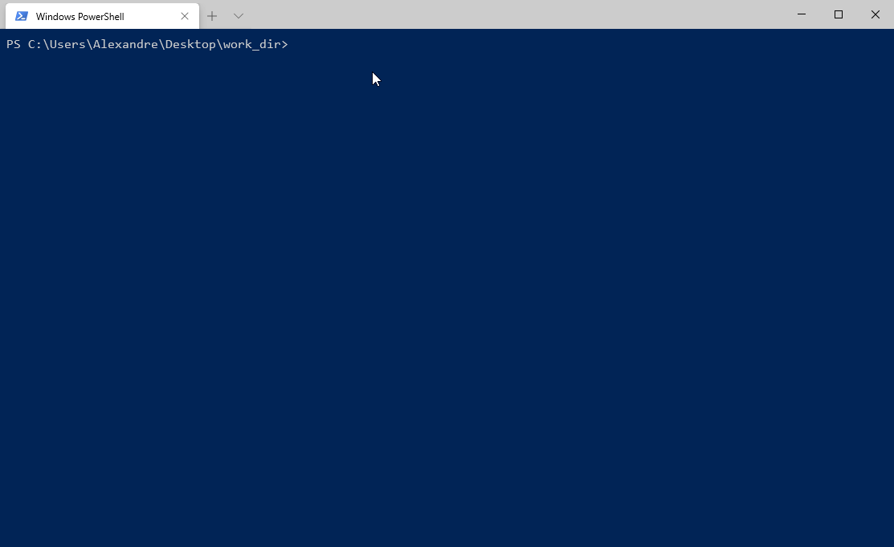

```bash
# Then set your working directory inside the downloaded repository
cd EFREI-M1-SNMP
```
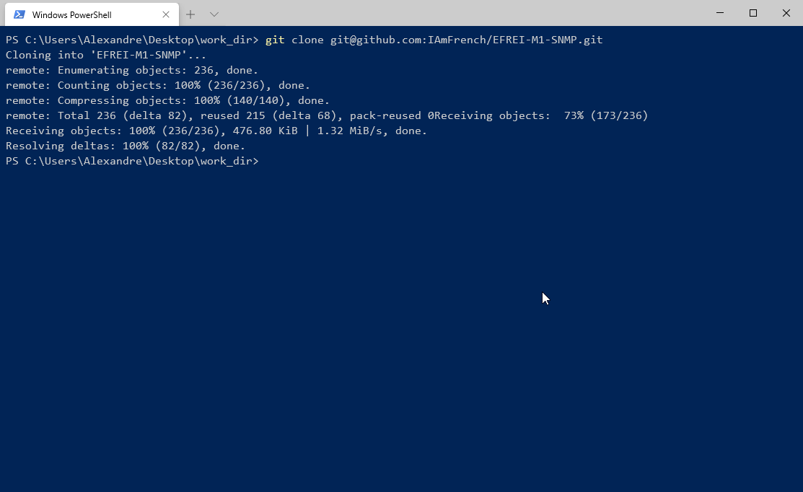


```bash
# And finally launch the stack
# Since you don't have on your local registry the required images, docker-compose will build them for you
# PS: The initial build will take some times
docker-compose up -d
```
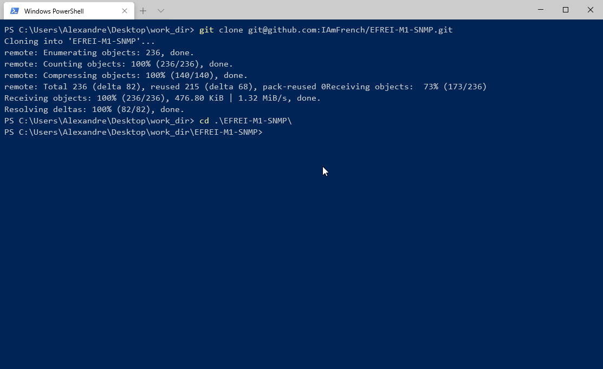
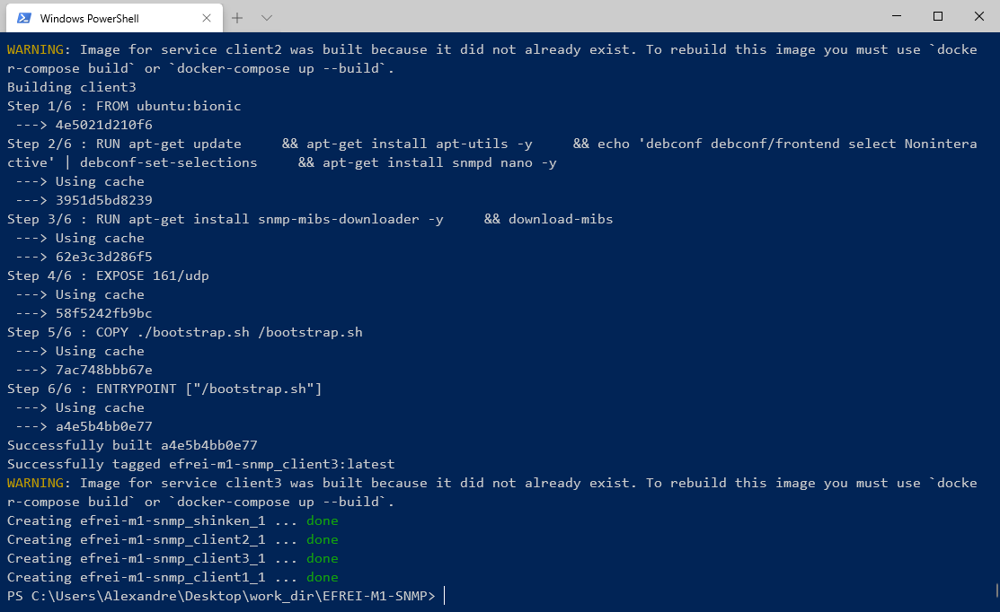

Tips: You can check your the status of your stack by using the `docker-compose ps` command
```bash
docker-compose ps
```
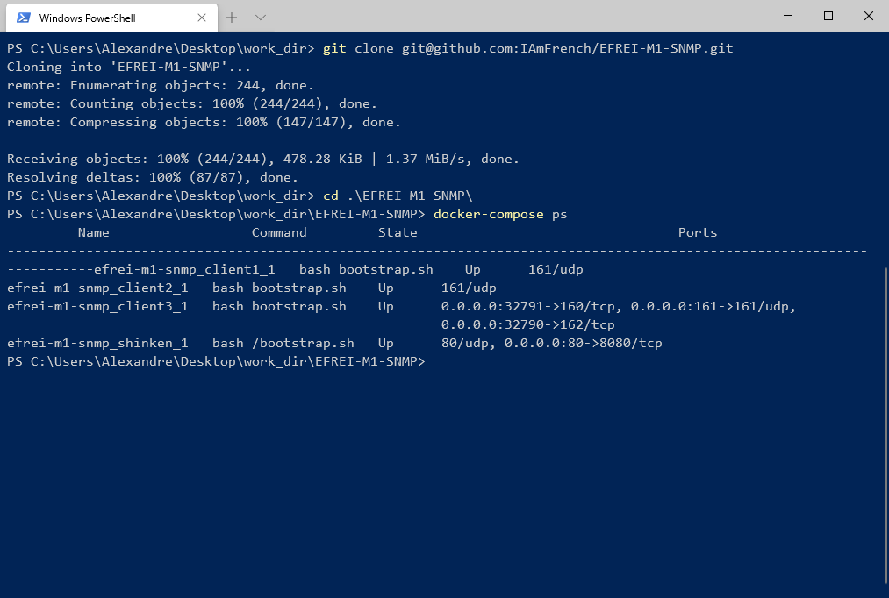

or using the Docker Desktop Dashboard:
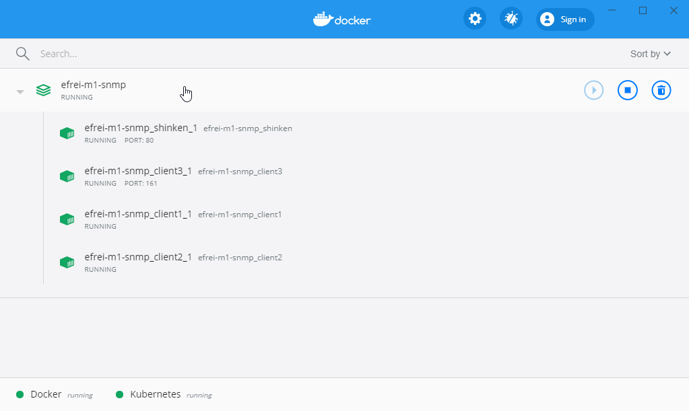

> Tips: You can listen all logs by clicking on the project stack

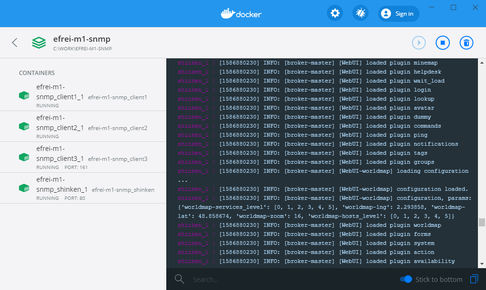

## Access
You can open the Shinken GUI at http://localhost:80
> Username: admin    
> Password: admin

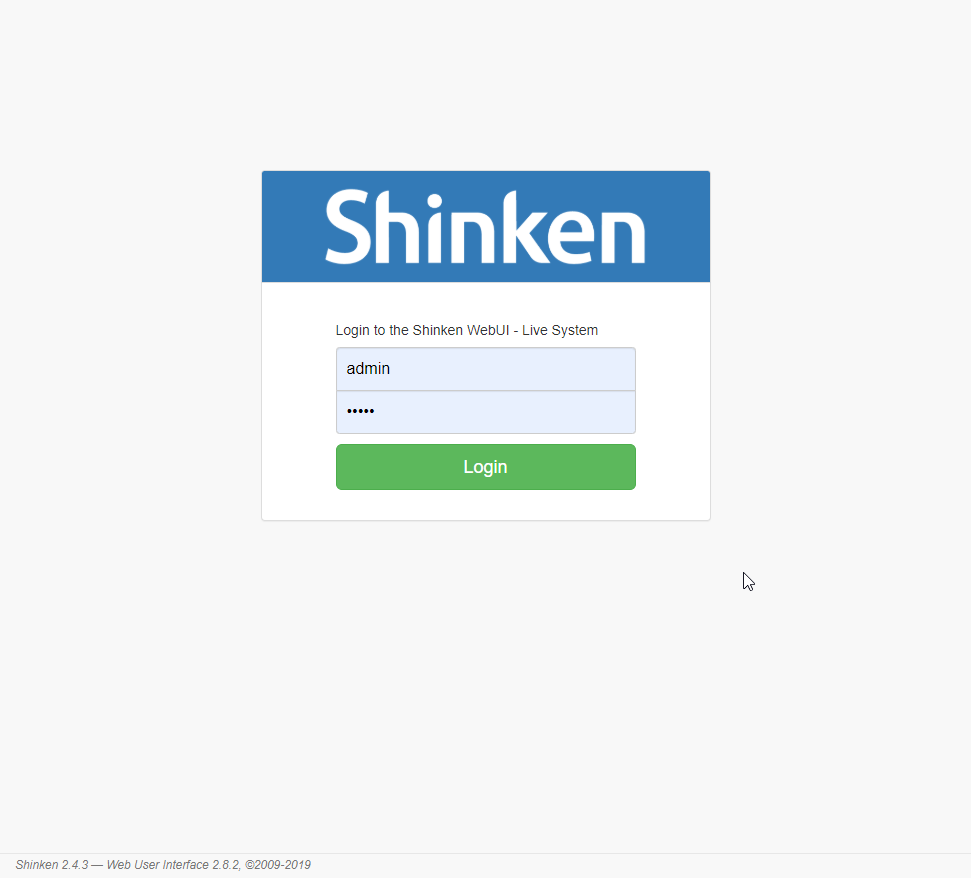


Then you can view our host in the [`host menu`](http://localhost:80/all?search=type:host%20is:up%20isnot:ack%20isnot:downtime)
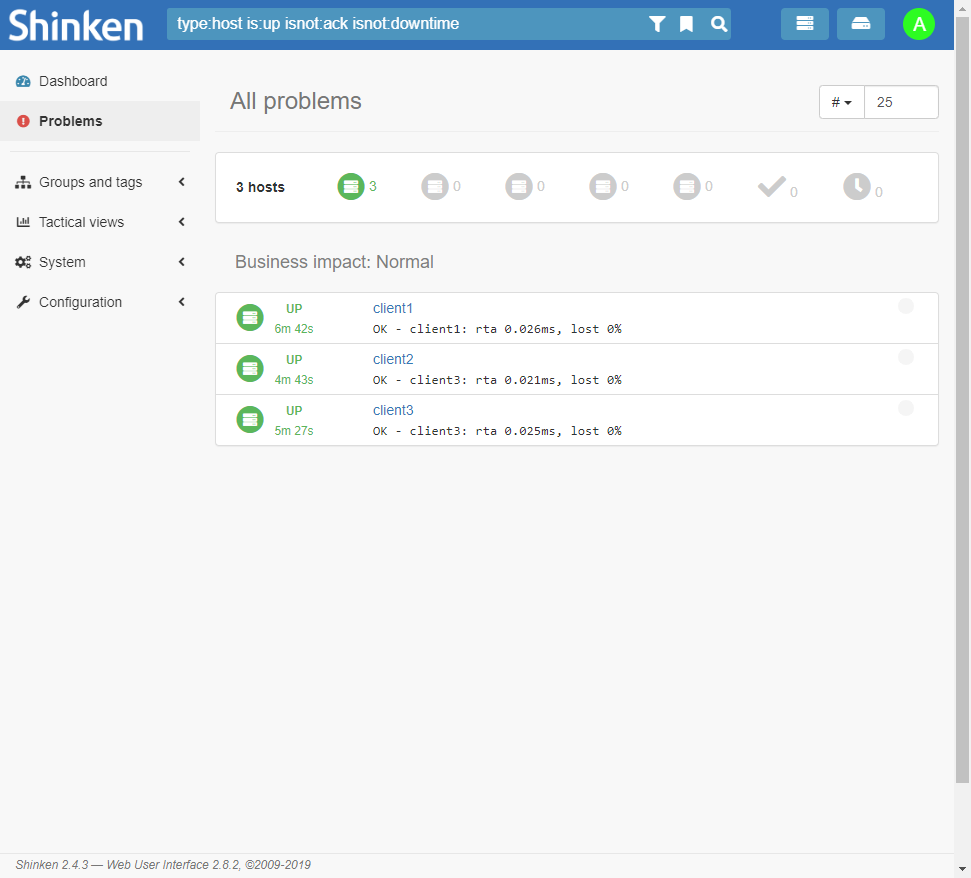

Open a host and check infos about it.
You can see various informations collected by the snmp agent

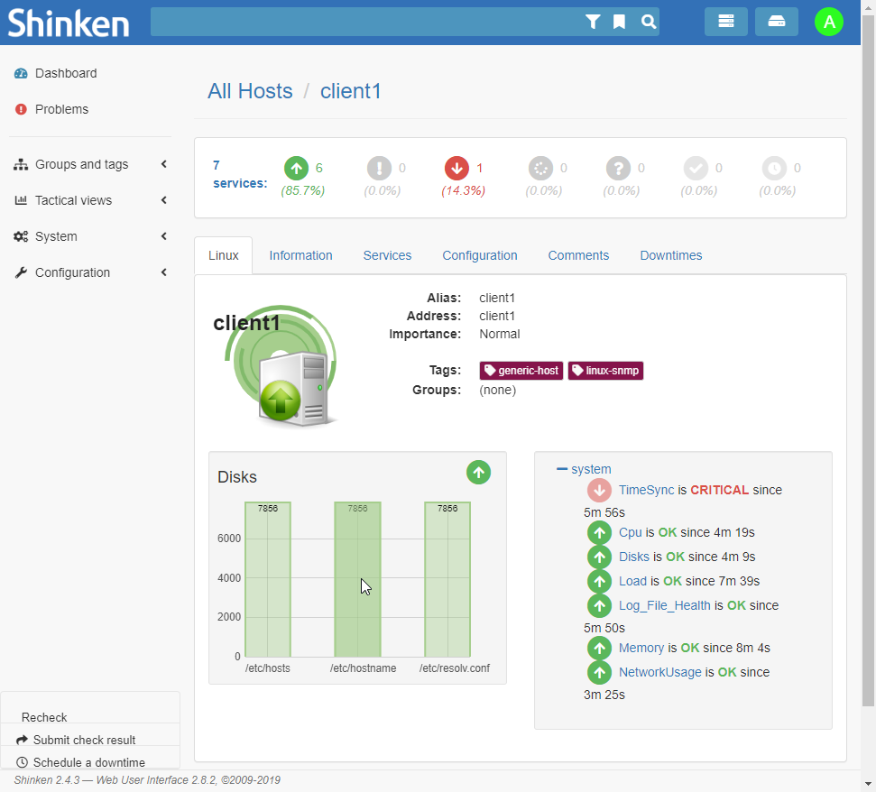
> Note: The TimeSync isn't available because it check a NTP agent, we only unse SNMP for this lab.


Let's open the [`Disks`](http://localhost:80/service/client1/Disks) metric from our [`client1`](http://localhost:80/host/client1) host:
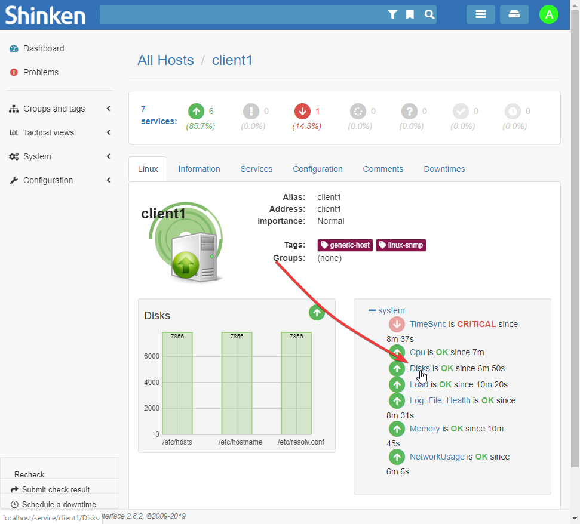

Here is the [`Disks`](http://localhost:80/service/client1/Disks) page:
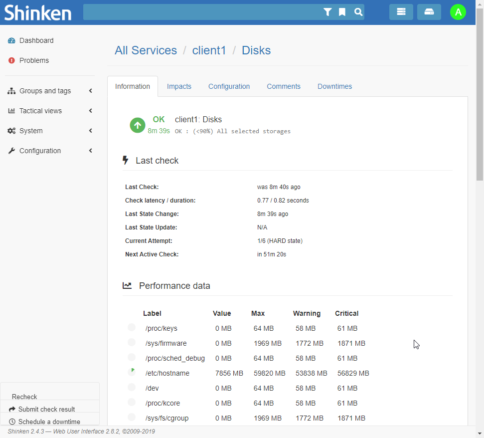


## Configuration
If you want you can add or remote host to shinken, to do so, just edit the [`./shinken/config/clients.cfg`](./shinken/config/clients.cfg) file

## Clean-up
```bash
# To stop and remove the stack just use the docker-compose down command with -v as an argument
docker-compose down -v
```
